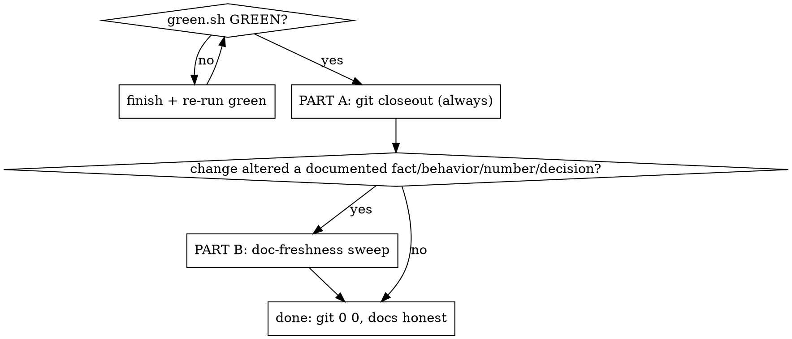

# Landing Changes

## Overview

A code change is not done when the code works. It is done when **(A)** git state
is `0  0` against `origin/main` and **(B)** every doc that described the thing you
changed now reflects *only the new reality* — no stale numbers, no superseded
discussion. Both, every time. Code that works but leaves `main` un-synced or docs
contradicting it is unfinished work, not finished work.

Two repos: the **code repo** (`~/vscode/AutoBroker/AutoBroker`) and the **plan
repo** (`~/vscode/AutoBroker/AutoBroker-dev-plan`, source-of-intent: reports +
ADRs). Closeout applies to *whichever repos your change touched*.

## When to use

- After ANY code change that you're about to commit / call done / leave.
- When a change altered a behavior, number, contract, default, or decision that
  an existing doc, report, comment, or skill describes.

When NOT to use: mid-implementation (finish the code + green first), or a pure
question with no code change.

## The two parts

## Part A — Git closeout (CLAUDE.md "definition of done")

1. **Green gate passes.** `bash scripts/green.sh`. If the change touched any
   UI / `data-testid` / harness file: `RUN_UI_FUNCTIONAL=1 bash scripts/green.sh`.
2. **Commit**, staging explicit paths only, prefix `phaseN/<skill>:`. **NEVER** a
   `Co-Authored-By: Claude` / "Generated with Claude" trailer (hard rule).
3. **Push** the branch.
4. **Merge to `main`** — no-op if you're on `main`; from a worktree/branch use
   **`git merge --ff-only`** (or rebase-merge). Never a `--no-ff` merge commit —
   history stays linear.
5. **Align local main**: `git rev-list --left-right --count HEAD...origin/main`
   must read `0  0` (fetch first).
6. **Clean up**: remove the worktree + delete the merged branch; delete any
   untracked scratch you created (review packages, ledgers) — do not commit it.
7. **Plan-repo edits** (Part B) get their own commit + the same `0  0` closeout
   in that repo.

## Part B — Doc-freshness sweep (reflect ONLY the latest code)

Do NOT just grep the new symbol's name. Work from what the change **invalidated**:

1. **Enumerate the invalidated facts.** From your diff, list what is now false:
   changed numbers (caps, costs, counts, defaults), changed contracts/behaviors,
   resolved decisions, deleted/renamed things.
2. **Locate the docs that assert them.** Search BOTH repos for each fact (the old
   number, the old behavior phrase, the old name):
   - code repo: `CLAUDE.md`, `.claude/skills/**`, code comments, README.
   - plan repo: `ts-rebuild/**` reports, `ts-rebuild/architecture/**` ADRs, the
     `CURRENT STATE (live)` box in `ts-rebuild/index.html`.
3. **Strip stale DATA.** Fix every number/claim the change invalidated (e.g. a
   "records ≤80" that is now 20; a cost figure; a "TODO: add X" for an X now
   shipped). A roughly-right old number is still wrong — fix it.
4. **Strip stale DISCUSSION.** A decision that is now implemented is no longer an
   open question or a "we might do X" — collapse the deliberation down to the
   decision (or delete it). Superseded design debate is noise.
5. **Reflect only the latest code.** No doc may contradict the new behavior after
   the sweep. Verify by re-reading each edited section against the diff.
6. **Respect the repo split & history.** Long-form prose / ADRs / reports live in
   the PLAN repo, not the code repo. Don't rewrite a past report's findings to
   fake history — **append a dated correction** (see the 2026-06-21 "scan ~5
   nearest" reversal for the pattern).

## Quick reference

| step | command / target |
|---|---|
| green (UI-touching) | `RUN_UI_FUNCTIONAL=1 bash scripts/green.sh` |
| merge to main | `git merge --ff-only <branch>` (never `--no-ff`) |
| sync proof | `git rev-list --left-right --count HEAD...origin/main` → `0  0` |
| stale-fact search | grep old number / old behavior phrase / old name across both repos |
| plan-repo docs | `ts-rebuild/**` reports + `architecture/**` ADRs + live-status box |

## Common mistakes / red flags — STOP and finish

- Committed but didn't push / didn't merge / left `main` not `0  0`.
- Used `git merge --no-ff` (merge commit) instead of `--ff-only`/rebase.
- Skipped `RUN_UI_FUNCTIONAL` after a UI/testid/harness change.
- Added a Claude attribution trailer.
- "Docs are close enough" / "the old number is roughly right" — fix it anyway.
- Only grepped the new name; never asked "what numbers/claims did this make false?"
- Left a now-decided design as an open "we might…" discussion.
- Dumped long prose into the code repo instead of the plan repo.

## Rationalizations

| Excuse | Reality |
|---|---|
| "I'll push/merge later" | Later = forgotten. `0  0` now or it's not done. |
| "The change is internal, no docs touched" | Verify via the invalidated-facts list, don't assume. If truly none, skip Part B — but check first. |
| "Updating the report is out of scope" | A doc that contradicts the merged code is a defect you just shipped. |
| "Rewriting the old finding is cleaner" | Don't fake history — append a dated correction. |
