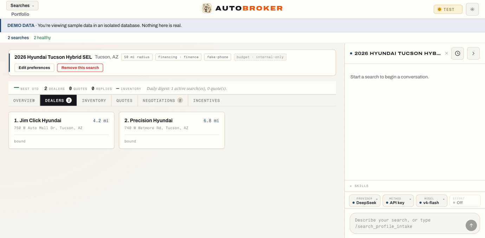

# AutoBroker

Local-first, provider-agnostic new-car quote pipeline. AutoBroker discovers
dealers, pulls real dealer email/web quotes, audits the numbers, and helps you
negotiate — driven by 18 skills (9 LLM-backed for extraction and drafting, 9
deterministic for the load-bearing math and orchestration), with humans approving
anything irreversible.



> Shown with the built-in zero-config demo data (`AUTOBROKER_DEMO_SEED=1`) — no
> API key, Gmail, or network required.

This repository is the **full-TypeScript rebuild** of AutoBroker. It is built
from the ground up, one skill at a time in dependency × risk order, against the
frozen legacy Python implementation (`../AutoBroker-Python`) as a read-only
parity oracle. Mastra 1.x owns orchestration and durable workflow state, AI
SDK 6 is the provider layer, and React/Vite is the local UI surface before the
optional Electron shell.

---

## Privacy — read before configuring providers

**The default LLM provider is DeepSeek (`api.deepseek.com`).** DeepSeek is also
the agent that runs AutoBroker's live test harness against the real corpus.

Per DeepSeek's privacy policy, **your inputs, prompts, and uploaded files are
stored on servers in the People's Republic of China (PRC) and may be used to
train DeepSeek's models.** AutoBroker's core job is to read your **private Gmail
content and dealer PII** — dealer replies are passed verbatim to the model when
extracting quotes. With the default provider, that sensitive content is routed
to, stored in, and potentially trained on inside the PRC.

If you do not accept this, do not use the default. Instead set one of the other
two first-class providers:

- `ANTHROPIC_API_KEY` — route LLM calls to Anthropic (Claude) via the API key
  (per-token billed).
- `OPENAI_API_KEY` — route LLM calls to OpenAI.

All three providers (DeepSeek, Anthropic, OpenAI) are first-class and
switchable. Provider selection is policy-driven (`useCase → ModelAlias`); you do
not edit workflow code to change providers — set the corresponding key and the
provider registry routes there.

**Switching at runtime — the chat-rail AgentBar.** Above the chat input, a
four-box selector (Provider · Method · Model · Thinking effort) lets you pick the
lane per run; it only enables combinations whose credential is present. DeepSeek
runs on its API key; **Claude runs on either an API key OR a Pro/Max
subscription (OAuth)** — see below. Until you pick explicitly, the server's
default lane is used, so existing behavior is unchanged.

**Claude on your subscription (OAuth, lane B).** Set `CLAUDE_CODE_OAUTH_TOKEN`
(from `claude setup-token`) to run LLM calls on your Claude **Pro/Max
subscription** instead of per-token billing, via Anthropic's official Agent SDK.
This is for **personal, single-user use of your own subscription** (Anthropic's
"ordinary individual usage of Claude Code and the Agent SDK") — AutoBroker is
local-first and you bring your own token; it does **not** route others'
subscription credentials. A multi-user deployment must use `ANTHROPIC_API_KEY`
instead. Subscription usage is flat-rate (the cost ledger records it as
subscription, not a per-call dollar amount). Privacy note: this routes your Gmail
content / dealer PII to Anthropic (US) rather than the PRC — generally a stronger
posture than the DeepSeek default.

---

## Quickstart

**Fastest path — see it work with zero keys.** The built-in demo seeds sample
data into an isolated `test`-mode database; no API key, Gmail, or network needed:

```bash
pnpm install            # requires Node >= 24.13.0 and pnpm 9
pnpm doctor             # read-only env self-check (prints the fix for any problem)
pnpm demo               # builds the server once, then boots the seeded demo (mode=test)
# in a second terminal:
pnpm --filter @autobroker/ui dev
# open http://localhost:5173 — a populated dashboard, all sample data
```

**To do real work**, add at least one provider key (and a Google Maps key for
dealer search):

```bash
cp .env.example .env
# .env ships AUTOBROKER_MODE=test, so copying it starts you in SAFE test mode
# (every send is the local fake mailbox). Delete/change that line to go buyer.
#
# Set keys in the app — Settings → API keys (paste → Test connection → Save) —
# or hand-edit .env. Read the Privacy section above before choosing a provider.
```

**Which keys do you actually need?**

- **One LLM provider key** — DeepSeek *or* Anthropic *or* OpenAI. DeepSeek is the
  default/keystone; the other two are switchable. Setting several keys does not by
  itself pick a lane — the DeepSeek policy default wins until you choose one in the
  chat-rail AgentBar (or set `AUTOBROKER_AGENT_PROVIDER`). Claude can also run on a
  Pro/Max **subscription** (OAuth) instead of per-token billing — see the guide.
- **`GOOGLE_PLACES_API_KEY`** — required for dealer search; without it, intake
  suspends at the location step.
- **Gmail OAuth** — required only for the email pipeline (reading dealer replies,
  sending follow-ups); optional for search-and-audit-only use.

> **Every credential has a step-by-step manual guide**, including the Gmail
> Google-Cloud setup and the optional Claude subscription/OAuth lane:
> **[docs/onboarding/CREDENTIALS_SETUP.md](docs/onboarding/CREDENTIALS_SETUP.md)**.

The no-keys verification floor (all three run without any provider key):

```bash
pnpm typecheck     # tsc --build across the workspace
pnpm test          # vitest
pnpm ui:functional # deterministic Playwright UI lane against seeded fixtures
```

Parity-period data (cold-copied product SQLite DB, Mastra runtime DB, logs,
config) lives under `~/.autobroker-ts/`, isolated from the legacy Python repo's
`~/.autobroker/`.

### Run the app

After `pnpm install` and setting at least one provider key, build and start the
backend server, then open the UI:

```bash
# 1. Build the server (required once; re-run after source changes)
pnpm --filter @autobroker/server build

# 2. Start the backend server (listens on 127.0.0.1:8100)
node apps/server/dist/index.js

# 3. In a second terminal: start the Vite dev server for the UI
pnpm --filter @autobroker/ui dev
# Open http://localhost:5173 in your browser.
```

Optional — open as a desktop app (requires the bundled Electron shell):

```bash
pnpm desktop:bundle   # build the self-contained server bundle
pnpm desktop:start    # launch the Electron shell
```

> **Note:** Full pipeline operation (Gmail inbox reading, lead submission) also
> requires a Gmail OAuth credential — set it up with the one-time command-line
> consent flow in
> [docs/onboarding/CREDENTIALS_SETUP.md §5](docs/onboarding/CREDENTIALS_SETUP.md#gmail-oauth)
> (the in-app Connect button is still a placeholder). Both `pnpm test` and
> `pnpm ui:functional` need no provider keys (they are the no-keys verification
> floor shown above).

---

## What AutoBroker does — the 18 skills

The pipeline is **18 skills**, built one at a time in dependency × risk order
(phase 1 → 5). Nine call an LLM (extraction, field-mapping, drafting); nine are
fully deterministic (the load-bearing audit math, ranking, and orchestration).
Read-only scans run freely. The two **destructive** skills require explicit human
confirmation. The three **irreversible-send** skills use the L2 approval path;
approvals are manual by default and can be explicitly automated by channel.

| Skill (`/slash`) | Phase | Risk | Engine | What it does |
|---|---|---|---|---|
| `search_profile_intake` | 1 | local write | LLM | Create a new-car search profile from a slash form or freeform prose. |
| `quote_audit` | 1 | read-only | deterministic | Run the 10-check audit over a profile's recent dealer quotes and flag issues. |
| `quote_compare` | 1 | read-only | deterministic | Rank and compare multiple dealer quotes side by side. |
| `inventory_compare` | 1 | read-only | deterministic | Rank inventory listings against a search profile. |
| `dealer_geosearch` | 2 | local write | LLM | Find dealers near the profile's location via the browser. |
| `inventory_site_scan` | 2 | local write | LLM | Scan the profile's dealer sites for matching inventory, then auto-chain a shopping-site scan. |
| `inventory_aggregator_scan` | 2 | local write | LLM | Search marketplace sites (Cars.com, visor.vin, Edmunds) for matching new-car listings nearby. |
| `inventory_link_scan` | 2 | local write | LLM | Visit unscraped dealer inventory URLs and match listings against the profile. |
| `incentive_scrape` | 2 | local write | LLM | Scrape current manufacturer incentives for each active profile's vehicle. |
| `dealer_inbox_check` | 3 | local write | deterministic | Read dealer replies from the mailbox and surface new messages. |
| `dealer_reply_extract` | 3 | local write | LLM | Extract a structured quote from a dealer's email reply. |
| `dealer_hygiene` | 3 | **destructive** | deterministic | Classify CRM threads, suppress noisy senders, delete orphan records (three staged confirms). |
| `quote_pipeline` | 4 | local write | deterministic | Orchestrate the post-reply chain (reply-extract → incentive → audit → compare). |
| `daily_digest` | 4 | local write | deterministic | Build a daily digest of pipeline activity across active profiles. |
| `pipeline_reset` | 4 | **destructive** | deterministic | Wipe the entire local pipeline DB and recreate the schema (typed-YES confirm). |
| `dealer_web_lead_submit` | 5 | **irreversible** | LLM | Submit a lead to a dealer's web form (L2 approval; manual by default). |
| `negotiation_followup` | 5 | **irreversible** | LLM | Draft and send a negotiation follow-up email (L2 approval; manual by default). |
| `dealer_closeout_email` | 5 | **irreversible** | deterministic | Send a templated close-out email (L2 approval; manual by default). |

Two behaviors worth knowing up front: **trim is a required field** — intake asks
for it, and all three browser scans stop with `trim_missing` without it; and a
completed `inventory_site_scan` **auto-chains** an `inventory_aggregator_scan` for
the same profile (kill switch `AUTOBROKER_SITESCAN_CHAIN=0`). The authoritative
definition of every skill (id, slash command, risk class, profile-pin posture)
lives in [`packages/skills/src/registry.ts`](packages/skills/src/registry.ts).

---

## Architecture — the five layers

A pnpm monorepo with a strict **one-way** dependency wall, enforced by TS
project references. Frameworks stay in their owning layer: `core` remains pure
contracts, `model` owns provider adaptation, `workflows` owns Mastra
orchestration, `tools` owns all side effects, and `app` owns HTTP/UI shells.

| Layer | Package | Owns | May import frameworks? |
| --- | --- | --- | --- |
| 1. core | `packages/core` | Pure TYPES + Zod schemas (`DealerQuote`, `AuditFlag`, `SearchProfile`, `CapabilityFlags`, `ModelAlias`, run-status projections) | **No** — AI SDK / Mastra / Drizzle / Playwright are invisible here |
| 2. model | `packages/model` | AI SDK 6 provider layer: registry (`deepseek`, `anthropic`, `openai`), `policy(useCase->alias)`, `resolveModel(alias)`, canonical-message translation, structured-output strategy helpers | AI SDK 6 |
| 3. workflows | `packages/workflows` | Mastra 1.x backbone: one flat `createWorkflow` per skill, Memory-thread/session integration, OM chat-lane compacting, durable suspend/resume projection, L2 gate orchestration | Mastra |
| 4. tools | `packages/tools` | Gmail, browser (Playwright-native), product DB writes, calc/validators. **Only this layer touches the product DB or external APIs.** Mutating actions wear a code-level approval wrapper | Playwright, `@googleapis/gmail`, `google-auth-library`, `pdfjs-dist` |
| 5. app | `apps/server`, `apps/ui`, `apps/desktop` | Backend HTTP + SSE skill-run stream; React/Vite + AI SDK UI chat rail; Electron shell (optional; macOS install + auto-fresh) | Fastify, React (+ `@ai-sdk/react` for the chat rail), Electron |

Supporting packages: `packages/db` (Drizzle schema + better-sqlite3,
`drizzle-kit pull` baseline, `test_run_records` ledger; Mastra state lives in a
separate `mastra.db`), `packages/skills` (the 18 skill definitions).

**`ai` is pinned to `^6`** deliberately — v7's `LanguageModelV4` spec would
break V3-spec community providers. On the backend, AI SDK 6 is the provider
adapter (`createProviderRegistry` -> `LanguageModel` -> Mastra agent), not the
workflow engine. On the frontend, AI SDK UI remains first-class for the chat
rail and message streaming.

### Safety, in one line

Side effects can physically reach `browser.submit` / `gmail.send` **only**
through the L2 in-process gate handler, which fails **closed**. `AUTOBROKER_MODE`
is the single send-control variable: `AUTOBROKER_MODE=test` resolves every send
to the local fake mailbox, while `buyer` (the code default) enables real sends
through the always-on L2 gate. `AUTOBROKER_AUTO_SEND` is a separate approval
policy (`off|email|web_form|all`, default `off`) that replays only new allow-listed
first-send suspends; recovery, contact-flip, and email fallback stay manual. The three
irreversible skills (`dealer_web_lead_submit`, `negotiation_followup`,
`dealer_closeout_email`) really send in `buyer` mode through that same gate and
fake-send in `test` mode — via the one `AUTOBROKER_MODE` switch, with no separate
per-skill send-mode flag.

**Am I about to send real email?** A fresh clone is safe by construction: the
shipped `.env.example` sets `AUTOBROKER_MODE=test`, so copying it starts you in the
local fake-mailbox posture. The in-app TopBar toggle is authoritative and is read
fresh on every send. In `buyer` mode approvals are manual unless you explicitly
enable Automatic send approvals in Settings. See `CLAUDE.md` for the full
12-point invariant set.

---

## Legacy parity

The legacy Python implementation is frozen at **`../AutoBroker-Python`** and is
read-only until all 18 skills reach parity-GREEN, at which point AutoBroker (TS)
takes over and the Python repo retires.

---

## Setup / Onboarding

- [Agent setup guide](docs/onboarding/AGENT_GUIDE.md) — step-by-step instructions for an AI agent configuring a fresh install.
- [User guide](docs/onboarding/USER_GUIDE.md) — plain-language setup for the owner.
- [Credential setup (manual)](docs/onboarding/CREDENTIALS_SETUP.md) — human, step-by-step procedures for every API key and the Gmail OAuth client.

---

## Disclaimer

AutoBroker is an independent, personal automation tool. It is not affiliated
with, endorsed by, or otherwise connected to any automobile dealer, dealership
group, or OEM (including Toyota, Honda, Hyundai, Ford, GM, Stellantis, or
others); nor to DeepSeek, Anthropic, OpenAI, Google, or any other commercial
entity whose services it automates or integrates with. All trademarks and
service marks are the property of their respective owners.

AutoBroker is provided "as is" without warranty of any kind. The authors are not
responsible for any unintended communications sent to dealers, data shared with
third-party LLM providers, or consequences of automating car-buying workflows.
All irreversible actions require explicit human confirmation before they execute.

---

## License

MIT — see [LICENSE](LICENSE).

For data handling details (Gmail API, LLM data routing, local storage) see
[docs/DATA_HANDLING.md](docs/DATA_HANDLING.md).

For security and vulnerability reporting see [SECURITY.md](SECURITY.md).
